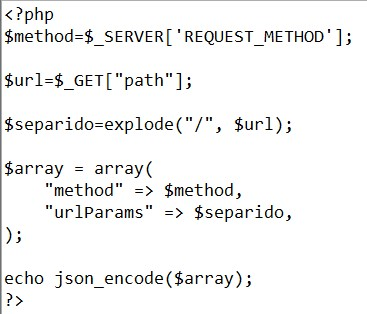
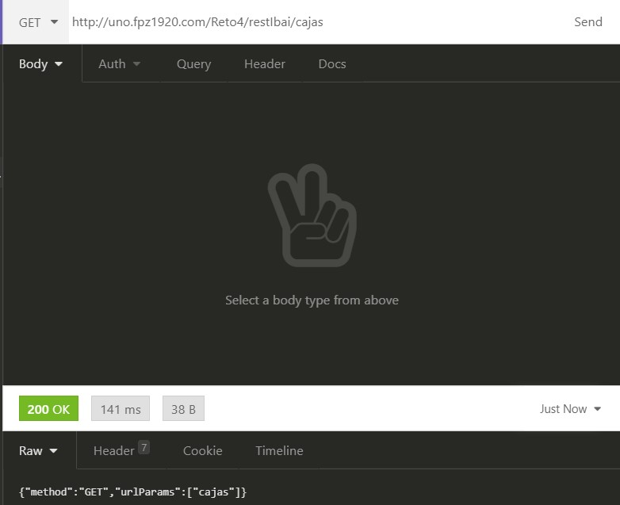
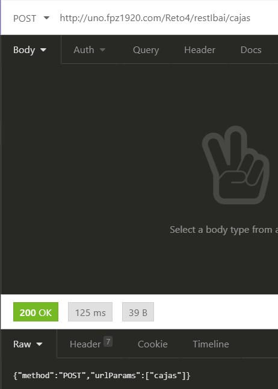
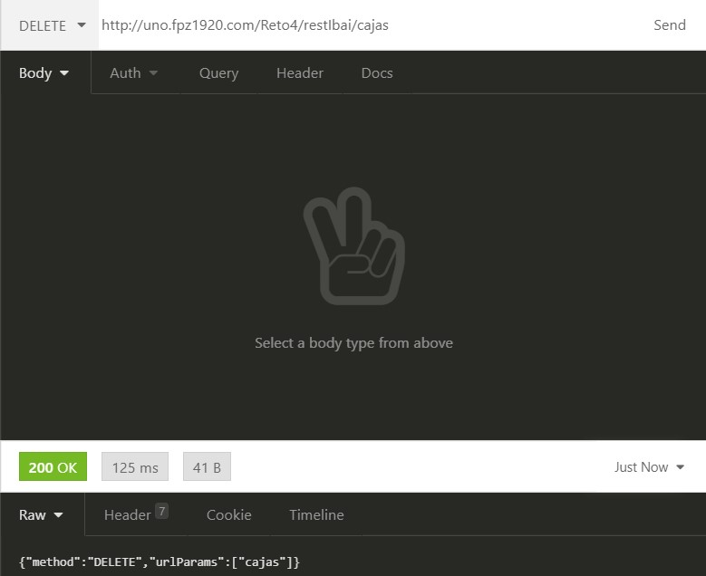
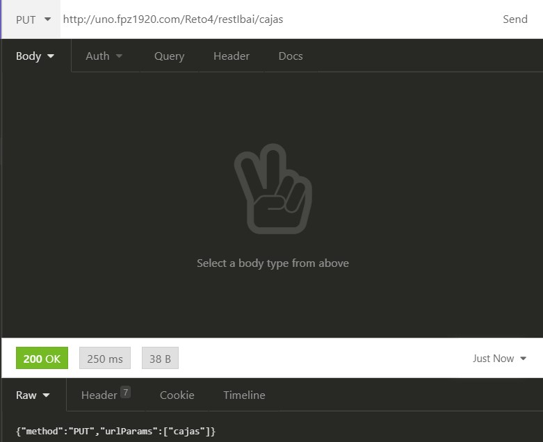

#Insomnia

### Ejercicio 1
* Configuras en .htcaccess para que recibir el path y redireccione al php

* Preparas un .php para separar las palabras que vienen por url separados por /:

 
 ### Ejercicio 2
* El php que procesa los datos para recibir los siguientes resultados:

* Metodo GET:

* Metodo POST:

* Metodo DELETE:

* Metodo PUT:
