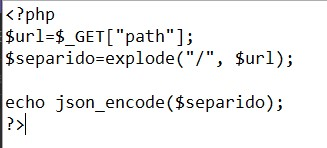
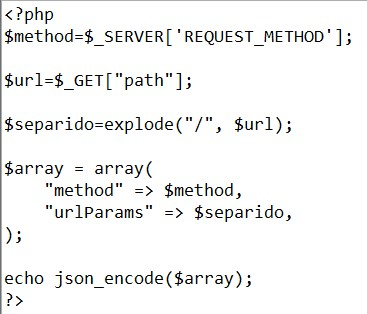
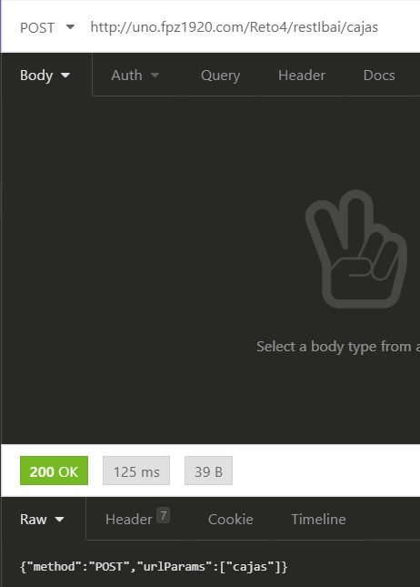
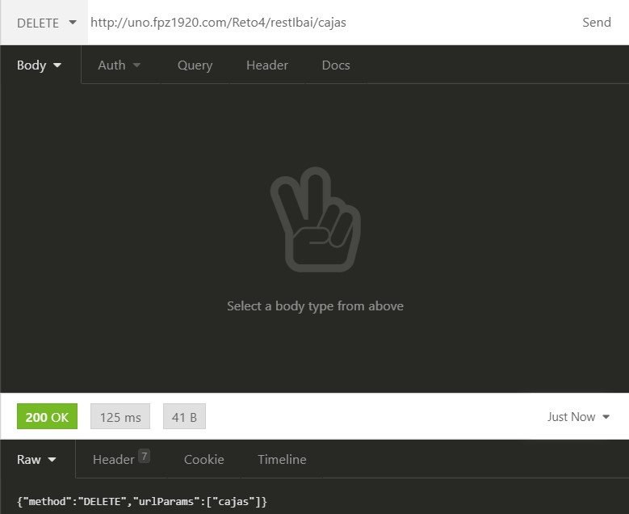
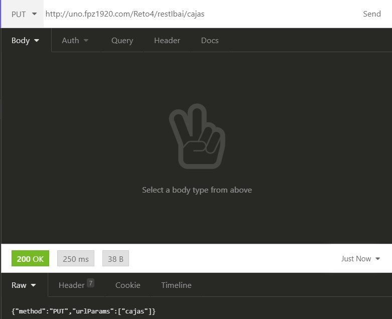

#Insomnia

### Ejercicio 1
* Configuras en .htcaccess para que recibir el path y redireccione al php

* Preparas un .php para separar las palabras que vienen por url separados por /:

 
 ### Ejercicio 2
* El php que procesa los datos para recibir los siguientes resultados:

* Metodo GET:

* Metodo POST:

* Metodo DELETE:

* Metodo PUT:

### Ejercicio 3
* Primero se recive y almacena el metodo de la peticion, y añades las variables para conectarte a la BBDD.

* Las variables de la URL las guardas en variables para utilizarlo posteriormente.

* El PHP para ejecutar una `Select` y devolver todas las cajas o la seleccionada por ID. 

Ejemplo:

* Se reciven los datos por URL para ejecutar el insertar en la BBDD.

Ejemplo:
* Se utiliza la ID previamente almacenada para mandar la id a la BBDD y ejecutar un procedimiento para borrar la caja seleccionada.

Ejemplo:
* Se utilizan los datos almacenados para ejecutar un procedimiento que realiza la modificacion de la caja.

Ejemplo:
